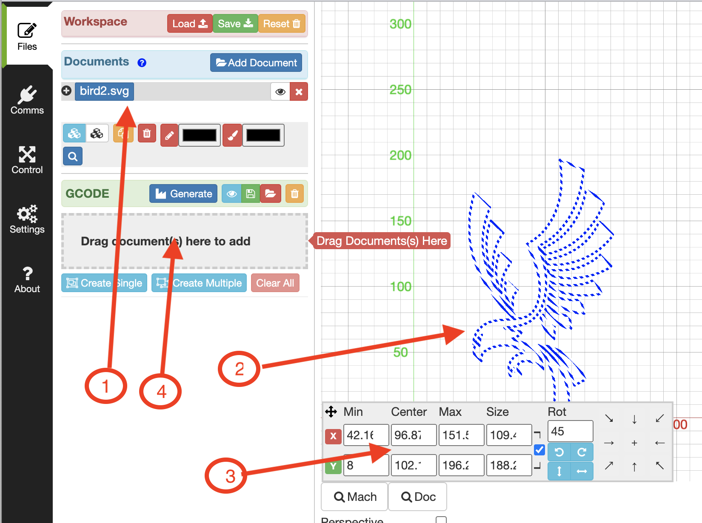
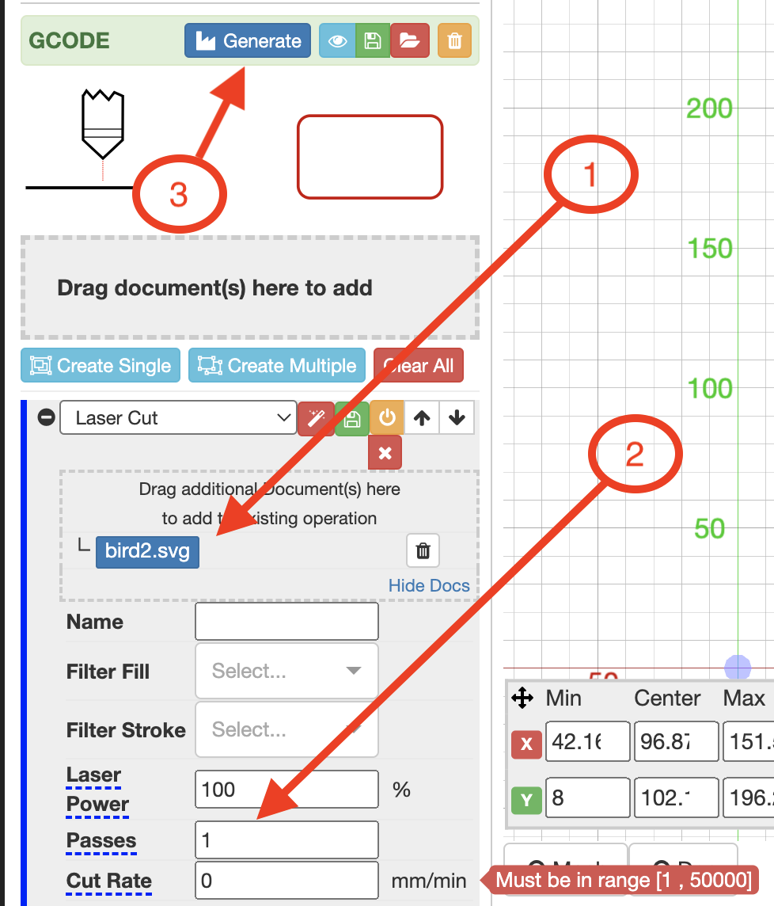

# **Loading and Cutting a Design using LaserWeb**

<br/>

## **1. Loading File**
---


- Select the Files Tab in LaserWeb (top left tab)
<br/>

 
 <br/>
<br/>

Drag a design file into the Documents area <br/>
    **OR**
<br/>Click on "Add Document" and select file using the dialog.

<br/>
<br/>

## **2. Position & Resize Design**

---

- Click on the added design to select it
<br/>


- [1] Selected Design<br/>
- [2] Selected Design Image <br/>
- [3] Selected Design Location & Size Dialog<br/>
- [4] GCode Generation Drag Area<br/>
<br/>
<br/>
- Use the [3] Dialog to Resize & Position the design within the Laser Bed Area.<br/>
<br/>
    
    * Remember that TOP-RIGHT on Laser Bed is BOTTOM-LEFTin LaserWeb *


<br/>

<br/>

## **3. Generate Laser Tool Path**

---
<br/>

-To start the ToolPath Step, Drag the Document ( from the Positioning Area ), <br/>to the GCode Drag Target Area [4] in above image
<br/>
<br/>


<br/>
<br/>

* [1] Current Design
* [2] Laser Power & Speed Settings
* [3] Gcode Generation Button
<br/>
- Set the Desired Laser Operation Parameters: 
    - Laser Power ( 
        *Percentage* )
    - Cut Rate ( 
        *mm/min* )
    - Height ( Height of top surface of material above bed - AKA Thickness *in mm*)
    - Passes (
        *number*)
        <br/><br/>
- Click on Generate Button [3] above
- GCode Generation Process will Run, check Process outputs in Terminal Area ( 
    *Bottom Right*) for errors.

## **4. Run Laser Job**
---
<br/>

- Re-open the Control Screen ( Control Tab )
- Ensure Material is Positioned Correctly on Laser Bed.
- Close Lid of Laser 
- Click the 
**RUN** Button on the Control Screen.
- Laser Runs GCode Path

# WARNING - Do NOT open Laser Lid while operation is still running.
- Ensure Laser Operation has finished before lifting Lid.

````Hint : If you are not sure the cutting opertion has cut all the way through the material, ensure the material is NOT MOVED when checking, If another pass in needed, simply close the lid and rerun the operation by clicking the Run button again.````


